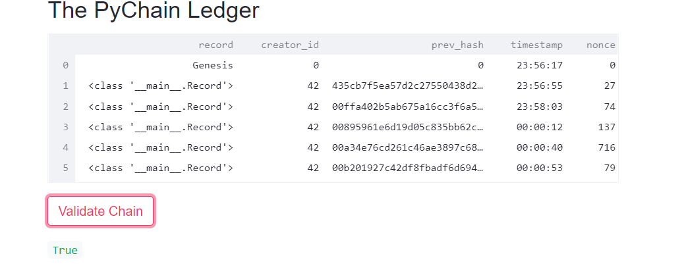

# Python Based Blockchain

## Summary

This project was to create a simple blockchain with interactivity provided by the streamlit platform. 

By creating bespoke dataclasses, the block class is used by the blockchain class.

The user can inspect any block in the chain, as well as adjusting the difficulty of the hashing algorithm to require more computational power.

Below are examples of the verification and validation that can be done using this application.

## Verification of Blockchain

## Validation of Blockchain

